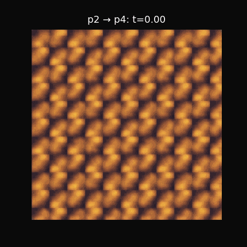
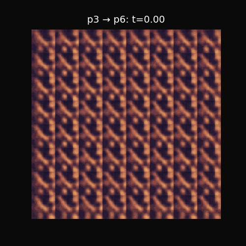
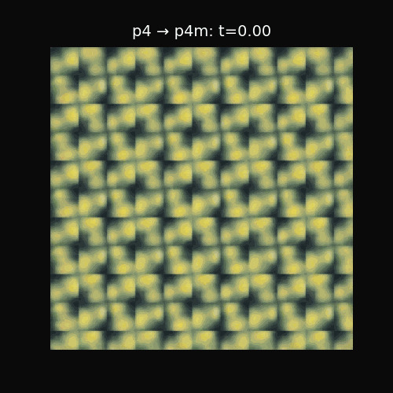
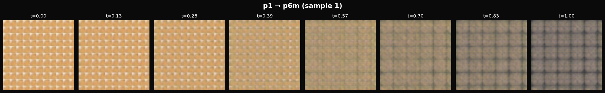

# Crystallographic Pattern Generator & Phase Transitions

<p align="center">
  
  
  
</p>

Generate, visualize, and learn continuous phase transitions between the 17 wallpaper groups using Flow Matching.

---

## Phase Transitions

The model learns smooth transitions between different crystallographic symmetry groups:

<table>
<tr>
<td align="center"><strong>p1 → p6m</strong><br>(No symmetry → Full hexagonal)</td>
<td align="center"><strong>p2 → p4</strong><br>(2-fold → 4-fold rotation)</td>
</tr>
<tr>
<td align="center"></td>
<td align="center"></td>
</tr>
<tr>
<td align="center"><strong>p3 → p6</strong><br>(3-fold → 6-fold rotation)</td>
<td align="center"><strong>p4 → p4m</strong><br>(Adding mirror symmetries)</td>
</tr>
<tr>
<td align="center"></td>
<td align="center"></td>
</tr>
</table>

<p align="center">
  
  <br><em>Transition from p1 (no symmetry) to p6m (full hexagonal symmetry)</em>
</p>

---

## The 17 Wallpaper Groups

The wallpaper groups represent the only 17 distinct ways to tile a 2D plane with a repeating pattern.

<p align="center">
  
</p>

| Lattice | Groups | Rotation | Description |
|---------|--------|----------|-------------|
| Oblique | p1, p2 | 1, 2 | Most general lattice |
| Rectangular | pm, pg, cm, pmm, pmg, pgg, cmm | 1, 2 | Right-angle axes |
| Square | p4, p4m, p4g | 4 | 90° rotational symmetry |
| Hexagonal | p3, p3m1, p31m, p6, p6m | 3, 6 | 60°/120° rotational symmetry |

---

## Architecture

```
┌─────────────────────────────────────────────────────────────────────────┐
│                         SYSTEM ARCHITECTURE                              │
├─────────────────────────────────────────────────────────────────────────┤
│                                                                          │
│   ┌──────────────┐     ┌───────────────┐     ┌────────────────────┐    │
│   │   Dataset    │────▶│   RGB VAE     │────▶│   Flow Matching    │    │
│   │   (H5 File)  │     │   Encoder     │     │   Transition       │    │
│   │   8500 imgs  │     │   256→64      │     │   v(z,t) learned   │    │
│   └──────────────┘     └───────────────┘     └────────────────────┘    │
│          │                    │                       │                 │
│          ▼                    ▼                       ▼                 │
│   ┌──────────────┐     ┌───────────────┐     ┌────────────────────┐    │
│   │   Pattern    │     │ Latent Space  │     │   Continuous       │    │
│   │   Generator  │     │   (64-dim)    │     │   Trajectory       │    │
│   │   17 Groups  │     │               │     │   z(t): 0→1        │    │
│   └──────────────┘     └───────────────┘     └────────────────────┘    │
│                               │                       │                 │
│                               ▼                       ▼                 │
│                        ┌───────────────┐     ┌────────────────────┐    │
│                        │   RGB VAE     │◀────│   Decoded          │    │
│                        │   Decoder     │     │   Transitions      │    │
│                        │   64→256      │     │                    │    │
│                        └───────────────┘     └────────────────────┘    │
│                                                                          │
└─────────────────────────────────────────────────────────────────────────┘
```

---

## Installation

```bash
git clone https://github.com/khabalghoul/c17.git
cd c17

# Create conda environment
conda create -n c17 python=3.10 -y
conda activate c17

# Install dependencies
pip install -r requirements.txt

# Install PyTorch with CUDA (adjust cuda version as needed)
pip install torch torchvision --index-url https://download.pytorch.org/whl/cu118
```

Requirements: Python 3.8+, PyTorch 2.0+, CUDA 11.8+ recommended.

---

## Quick Start

### 1. Generate Dataset

```bash
python scripts/generate_colored_dataset.py \
    --output-dir ./data/colored_crystallographic \
    --samples-per-group 500 \
    --resolution 256
```

### 2. Train VAE

```bash
python scripts/train_simple_vae.py \
    --data-path data/colored_crystallographic/crystallographic_patterns_colored.h5 \
    --epochs 100 \
    --latent-dim 64
```

### 3. Train Flow Matching

```bash
python scripts/train_flow_matching.py \
    --vae-checkpoint output/simple_vae_XXXX/best_model.pt \
    --epochs 100
```

---

## Project Structure

```
cristalography/
├── src/
│   ├── dataset/
│   │   ├── pattern_generator.py      # 17-group pattern generation
│   │   └── transition_dataset.py     # Transition pairs for training
│   ├── models/
│   │   ├── vae_simple_rgb.py         # RGB VAE
│   │   └── flow_matching_transition.py  # Flow Matching model
│   └── visualization/
├── scripts/
│   ├── train_flow_matching.py        # Main training script
│   ├── train_simple_vae.py           # VAE training
│   └── generate_colored_dataset.py   # Dataset generation
├── docs/
│   ├── ARCHITECTURE.md               # System architecture
│   ├── API_REFERENCE.md              # API documentation
│   └── Wallpaper_Groups_Guide_executed.ipynb  # Mathematical guide with visualizations
└── requirements.txt
```

---

## Technical Details

### Flow Matching

Uses Conditional Flow Matching (CFM) with Optimal Transport paths. The model learns a velocity field:

```
v(z, t, source, target) : ℝ^64 × [0,1] × G × G → ℝ^64
```

Training loss: `L = ||v_pred(z_t, t) - v_target||²`

Where `z_t = (1-t)·z_source + t·z_target`.

### VAE Architecture

```
Input: [B, 3, 256, 256] → Encoder → Latent [B, 64] → Decoder → Output: [B, 3, 256, 256]
```

---

## Documentation

| Document | Description |
|----------|-------------|
| [Architecture](docs/ARCHITECTURE.md) | System design, models, data flow |
| [API Reference](docs/API_REFERENCE.md) | Scripts and modules |
| [Wallpaper Groups Guide](docs/Wallpaper_Groups_Guide_executed.ipynb) | Mathematical foundations (interactive notebook with visualizations) |

---

## References

1. Lipman et al. "Flow Matching for Generative Modeling" (2023)
2. [The 17 Wallpaper Groups - Wikipedia](https://en.wikipedia.org/wiki/Wallpaper_group)
3. [International Tables for Crystallography](https://it.iucr.org/)

---

## License

MIT License
