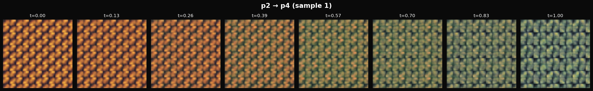
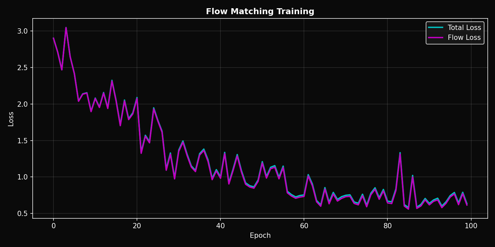

# 🔬 Crystallographic Pattern Generator & Phase Transitions

<p align="center">
  
  
  
  
</p>

<p align="center">
  <strong>Generate, visualize, and learn continuous phase transitions between the 17 wallpaper groups using state-of-the-art Flow Matching.</strong>
</p>

---

## ✨ Key Features

- **Pattern Generation**: Mathematically correct patterns for all 17 plane crystallographic groups
- **Variational Autoencoder (VAE)**: Learn latent representations of crystallographic patterns
- **Flow Matching Transitions**: State-of-the-art continuous transformations between symmetry groups
- **Real-time Dashboard**: Monitor training with live visualizations
- **Beautiful Visualizations**: High-quality images and animated GIFs of symmetry transitions

---

## 🎬 Phase Transitions in Action

### Continuous Symmetry Transformations

The model learns smooth transitions between different crystallographic symmetry groups:

<table>
<tr>
<td align="center"><strong>p1 → p6m</strong><br>(No symmetry → Full hexagonal)</td>
<td align="center"><strong>p2 → p4</strong><br>(2-fold → 4-fold rotation)</td>
</tr>
<tr>
<td align="center"></td>
<td align="center"></td>
</tr>
<tr>
<td align="center"><strong>p3 → p6</strong><br>(3-fold → 6-fold rotation)</td>
<td align="center"><strong>p4 → p4m</strong><br>(Adding mirror symmetries)</td>
</tr>
<tr>
<td align="center"></td>
<td align="center"></td>
</tr>
</table>

### Transition Strip Examples

<p align="center">
  
  <br><em>Transition from p1 (no symmetry) to p6m (maximum hexagonal symmetry)</em>
</p>

<p align="center">
  
  <br><em>Transition from p2 (180° rotation) to p4 (90° rotation)</em>
</p>

---

## 🔷 The 17 Wallpaper Groups

The **wallpaper groups** (or plane crystallographic groups) represent the only 17 distinct ways to tile a 2D plane with a repeating pattern. They are fundamental to crystallography, art, and mathematics.

<p align="center">
  
</p>

### Classification by Lattice Type

| Lattice | Groups | Rotation | Description |
|---------|--------|----------|-------------|
| **Oblique** | p1, p2 | 1, 2 | Most general lattice |
| **Rectangular** | pm, pg, cm, pmm, pmg, pgg, cmm | 1, 2 | Right-angle axes |
| **Square** | p4, p4m, p4g | 4 | 90° rotational symmetry |
| **Hexagonal** | p3, p3m1, p31m, p6, p6m | 3, 6 | 60°/120° rotational symmetry |

### Symmetry Properties

| Group | Rotation | Reflection | Glide | Description |
|-------|----------|------------|-------|-------------|
| p1 | - | - | - | Translation only |
| p2 | 2-fold | - | - | 180° rotation |
| pm | - | ✓ | - | Parallel mirrors |
| pg | - | - | ✓ | Glide reflection |
| cm | - | ✓ | ✓ | Mirror + glide |
| pmm | 2-fold | ✓✓ | - | Perpendicular mirrors |
| pmg | 2-fold | ✓ | ✓ | Mirror + perpendicular glide |
| pgg | 2-fold | - | ✓✓ | Perpendicular glides |
| cmm | 2-fold | ✓✓ | ✓ | Centered rectangle |
| p4 | 4-fold | - | - | 90° rotation |
| p4m | 4-fold | ✓ | ✓ | Square with all mirrors |
| p4g | 4-fold | ✓ | ✓ | Square with glides |
| p3 | 3-fold | - | - | 120° rotation |
| p3m1 | 3-fold | ✓ | - | Mirrors through centers |
| p31m | 3-fold | ✓ | - | Mirrors between centers |
| p6 | 6-fold | - | - | 60° rotation |
| p6m | 6-fold | ✓ | ✓ | Full hexagonal symmetry |

---

## 🏗️ Architecture Overview

```
┌─────────────────────────────────────────────────────────────────────────┐
│                         SYSTEM ARCHITECTURE                              │
├─────────────────────────────────────────────────────────────────────────┤
│                                                                          │
│   ┌──────────────┐     ┌───────────────┐     ┌────────────────────┐    │
│   │   Dataset    │────▶│   RGB VAE     │────▶│   Flow Matching    │    │
│   │   (H5 File)  │     │   Encoder     │     │   Transition       │    │
│   │   8500 imgs  │     │   256→64      │     │   v(z,t) learned   │    │
│   └──────────────┘     └───────────────┘     └────────────────────┘    │
│          │                    │                       │                 │
│          ▼                    ▼                       ▼                 │
│   ┌──────────────┐     ┌───────────────┐     ┌────────────────────┐    │
│   │   Pattern    │     │ Latent Space  │     │   Continuous       │    │
│   │   Generator  │     │   (64-dim)    │     │   Trajectory       │    │
│   │   17 Groups  │     │   Clustered   │     │   z(t): 0→1        │    │
│   └──────────────┘     └───────────────┘     └────────────────────┘    │
│                               │                       │                 │
│                               ▼                       ▼                 │
│                        ┌───────────────┐     ┌────────────────────┐    │
│                        │   RGB VAE     │◀────│   Decoded          │    │
│                        │   Decoder     │     │   Transitions      │    │
│                        │   64→256      │     │   (GIFs/Videos)    │    │
│                        └───────────────┘     └────────────────────┘    │
│                                                                          │
└─────────────────────────────────────────────────────────────────────────┘
```

### Training Curves

<p align="center">
  
</p>

---

## 📦 Installation

```bash
# Clone the repository
git clone https://github.com/yourusername/cristalography.git
cd cristalography

# Create virtual environment
python -m venv venv
source venv/bin/activate  # Linux/Mac
# or: venv\Scripts\activate  # Windows

# Install dependencies
pip install -r requirements.txt

# Optional: Install UMAP for better latent space visualization
pip install umap-learn
```

### Requirements

- Python 3.8+
- PyTorch 2.0+
- CUDA (recommended for training)
- ~4GB GPU memory for training

---

## 🚀 Quick Start

### 1. Generate Patterns

```python
from src.dataset import WallpaperGroupGenerator

# Create generator
generator = WallpaperGroupGenerator(resolution=256, seed=42)

# Generate a single pattern
pattern = generator.generate("p6m", motif_size=64, complexity=4)

# Generate all 17 groups
all_patterns = generator.generate_all(motif_size=64)
```

### 2. Create Dataset

```bash
# Generate full dataset (8500 samples: 500 per group × 17 groups)
python scripts/generate_colored_dataset.py \
    --output-dir ./data/colored_crystallographic \
    --samples-per-group 500 \
    --resolution 256
```

### 3. Train VAE

```bash
# Train the VAE for pattern reconstruction
python scripts/train_simple_vae.py \
    --data-path data/colored_crystallographic/crystallographic_patterns_colored.h5 \
    --epochs 100 \
    --latent-dim 64 \
    --batch-size 32
```

### 4. Train Flow Matching Transitions

```bash
# Train Flow Matching for phase transitions
python scripts/train_flow_matching.py \
    --vae-checkpoint output/simple_vae_XXXX/best_model.pt \
    --epochs 100 \
    --batch-size 128
```

### 5. Monitor Training (Optional)

```bash
# Launch the dashboard viewer in another terminal
python scripts/dashboard_viewer.py --output-dir output/flow_matching_XXXX
```

---

## 📁 Project Structure

```
cristalography/
├── src/
│   ├── dataset/
│   │   ├── pattern_generator.py      # Core 17-group pattern generation
│   │   ├── color_patterns.py         # Color scheme generation
│   │   ├── dataset.py                # PyTorch Dataset classes
│   │   └── transition_dataset.py     # Transition pairs for training
│   │
│   ├── models/
│   │   ├── vae_simple_rgb.py         # RGB VAE encoder/decoder
│   │   ├── flow_matching_transition.py  # Flow Matching model
│   │   └── neural_ode_transition.py  # Alternative Neural ODE approach
│   │
│   ├── visualization/
│   │   ├── visualize.py              # Pattern visualization
│   │   └── latent_explorer.py        # Latent space visualization
│   │
│   └── analysis/
│       └── symmetry_verifier.py      # Verify pattern symmetries
│
├── scripts/
│   ├── train_flow_matching.py        # Main training script
│   ├── train_simple_vae.py           # VAE training
│   ├── generate_colored_dataset.py   # Dataset generation
│   ├── dashboard_complete.py         # Training dashboard
│   └── visualize_patterns.py         # Visualization utilities
│
├── data/
│   └── colored_crystallographic/     # Generated dataset
│       ├── crystallographic_patterns_colored.h5
│       └── splits.npz
│
├── output/
│   └── flow_matching_*/              # Training outputs
│       ├── best_model.pt
│       ├── config.json
│       ├── visualizations/
│       └── full_visualizations/
│           └── transitions/*.gif     # Animated transitions
│
├── docs/
│   ├── WALLPAPER_GROUPS_MATH.md      # Mathematical background
│   ├── NEURAL_ODE_IMPLEMENTATION_PLAN.md
│   ├── ARCHITECTURE.md               # System architecture
│   └── images/                       # Documentation images
│
└── requirements.txt
```

---

## 🔬 Technical Details

### Flow Matching (State-of-the-Art 2023-2024)

This project uses **Conditional Flow Matching (CFM)** with **Optimal Transport** paths, the same technique used in:
- Stable Diffusion 3
- Meta's Imagen
- Google's research on generative models

**Key advantages over Neural ODE:**
- More stable training (no adjoint method needed)
- Faster inference (fewer function evaluations)
- Straighter trajectories (with Optimal Transport)
- Better theoretical properties

### Mathematical Formulation

The Flow Matching model learns a velocity field:

```
v(z, t, source, target) : ℝ^d × [0,1] × G × G → ℝ^d
```

Where:
- `z` ∈ ℝ^64 is the latent representation
- `t` ∈ [0,1] is the transition time
- `source`, `target` ∈ {17 wallpaper groups}

The training loss is simply MSE between predicted and target velocities:

```
L = ||v_pred(z_t, t) - v_target||²
```

Where `z_t = (1-t)·z_source + t·z_target` (linear interpolation).

### VAE Architecture

```
Input: [B, 3, 256, 256] RGB image
       ↓
Encoder: Conv layers with residual blocks
       ↓
Latent: [B, 64] dimensional representation
       ↓
Decoder: Transposed convolutions
       ↓
Output: [B, 3, 256, 256] reconstructed image
```

---

## 📊 Results

### Latent Space Organization

The VAE learns a structured latent space where patterns cluster by symmetry group:

- **Hexagonal groups** (p3, p6, p6m) cluster together
- **Square groups** (p4, p4m, p4g) form their own cluster
- **Rectangular groups** form a continuum based on symmetry complexity

### Transition Quality

The Flow Matching model achieves:
- **Smooth transitions** between any pair of groups
- **Physically meaningful** intermediate states
- **Stable training** without mode collapse

---

## 📚 Documentation

| Document | Description |
|----------|-------------|
| [Wallpaper Groups Math](docs/WALLPAPER_GROUPS_MATH.md) | Complete mathematical guide to the 17 groups |
| [Neural ODE Plan](docs/NEURAL_ODE_IMPLEMENTATION_PLAN.md) | Detailed implementation plan |
| [Architecture](docs/ARCHITECTURE.md) | System architecture and data flow |
| [API Reference](docs/API_REFERENCE.md) | Scripts and module documentation |

---

## 🔜 Future Work

- [ ] Conditional generation (specify target symmetry group)
- [ ] 3D space group support (230 groups)
- [ ] Interactive web demo
- [ ] Disentangled latent representations
- [ ] Symmetry-aware loss functions

---

## 📄 References

1. **Lipman et al.** "Flow Matching for Generative Modeling" (2023) - Core Flow Matching theory
2. **Liu et al.** "Flow Straight and Fast" (2023) - Rectified Flow
3. **The 17 Wallpaper Groups** - [Wikipedia](https://en.wikipedia.org/wiki/Wallpaper_group)
4. **International Tables for Crystallography** - [IUCr](https://it.iucr.org/)

---

## 📄 License

MIT License - See [LICENSE](LICENSE) file for details.

---

<p align="center">
  Made with ❤️ for crystallography and machine learning
</p>
