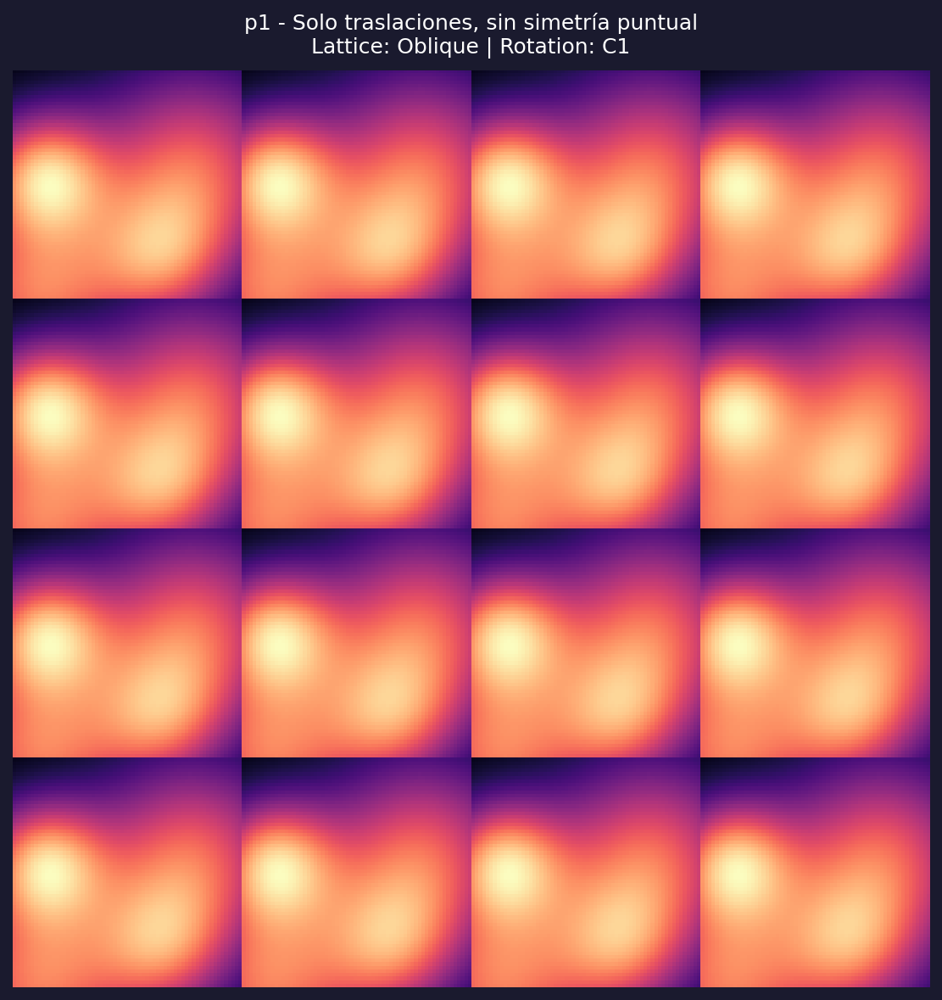
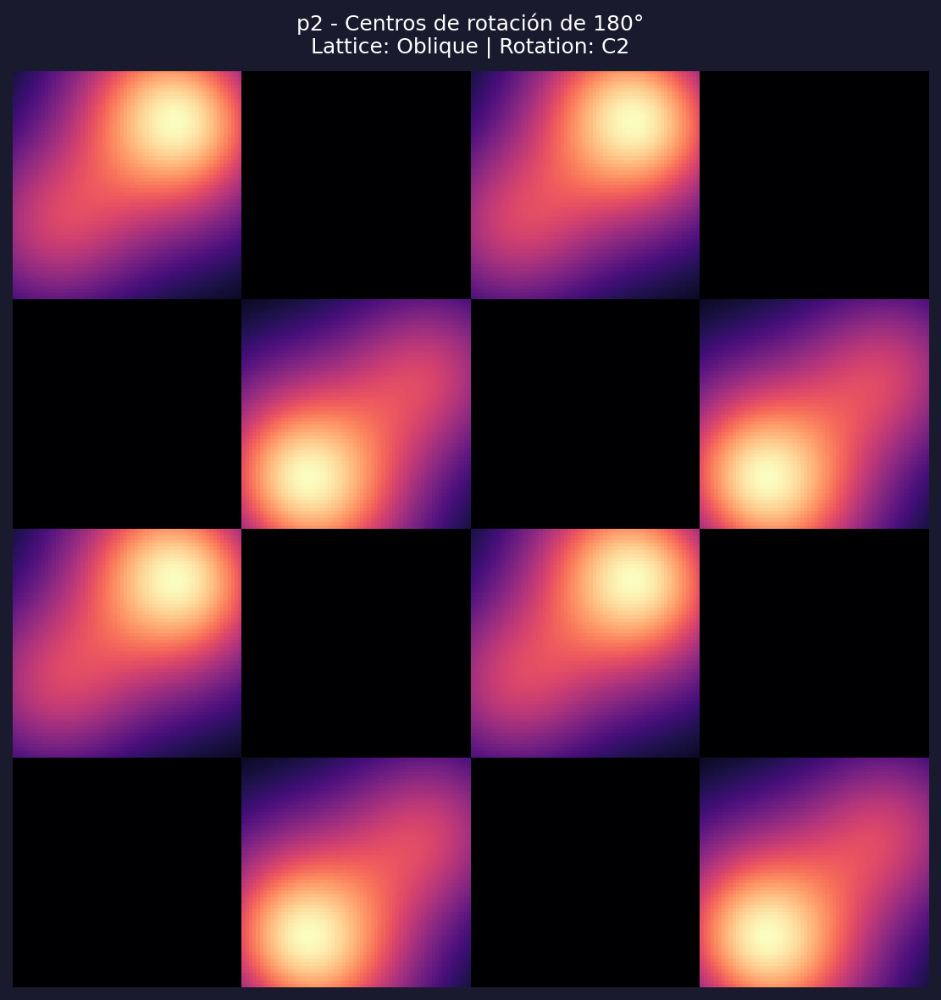
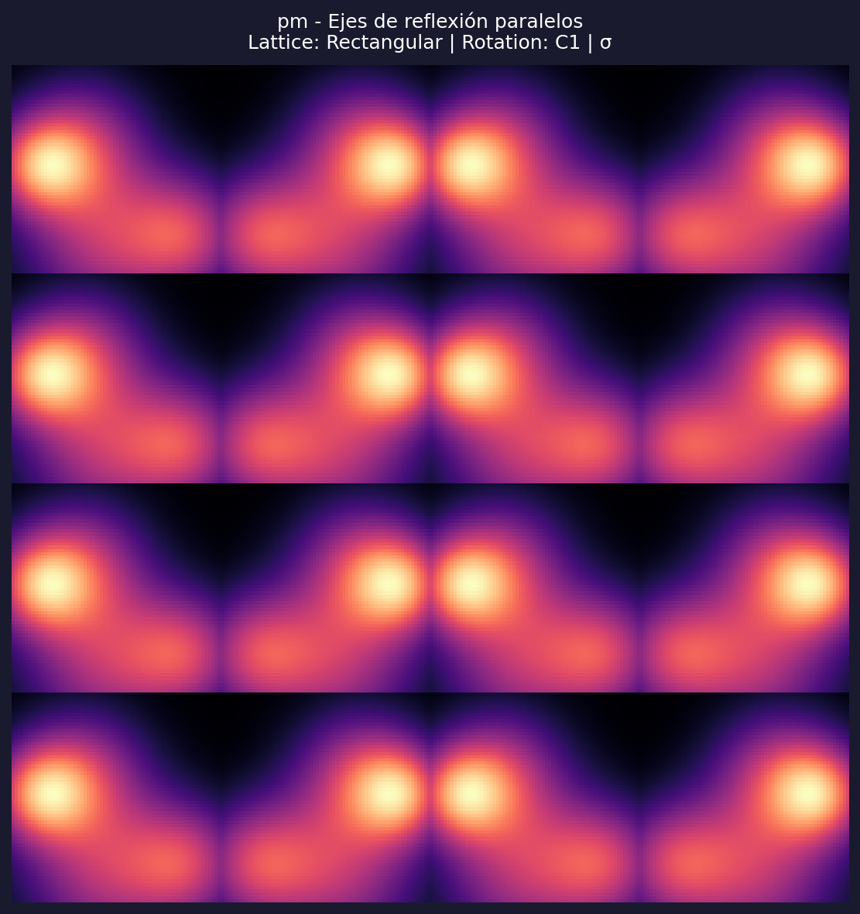
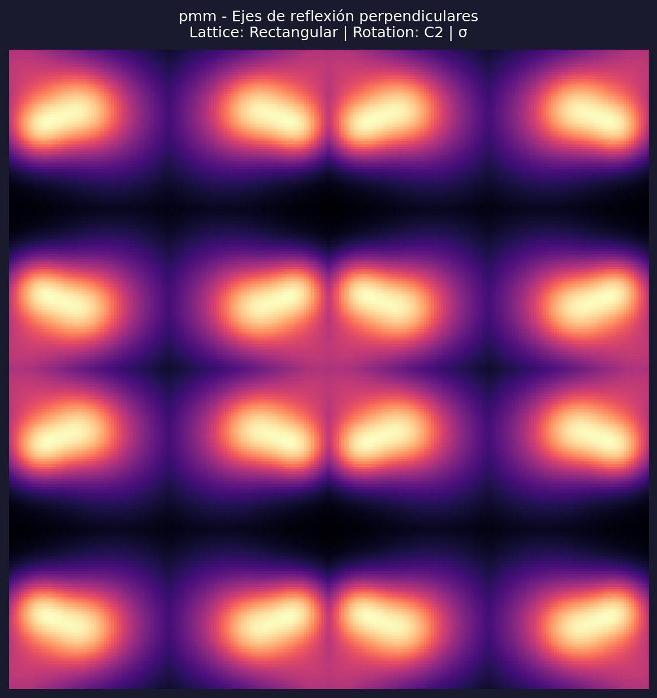
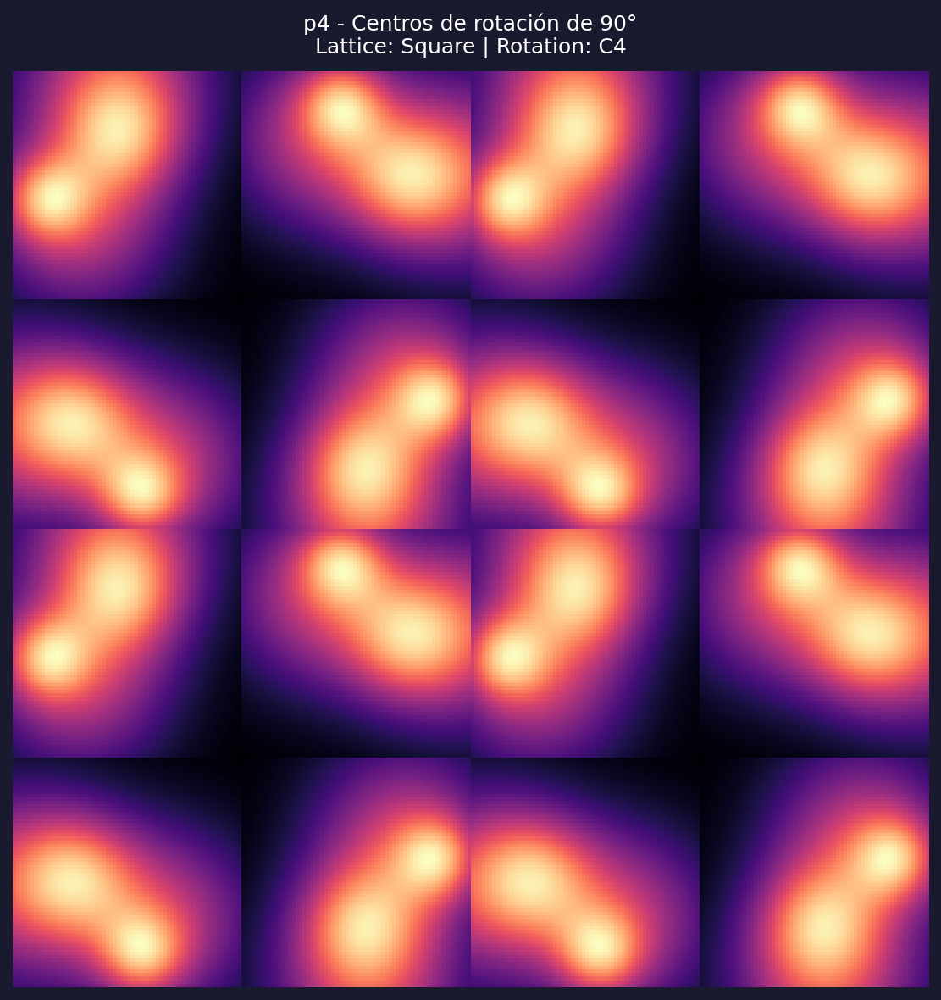
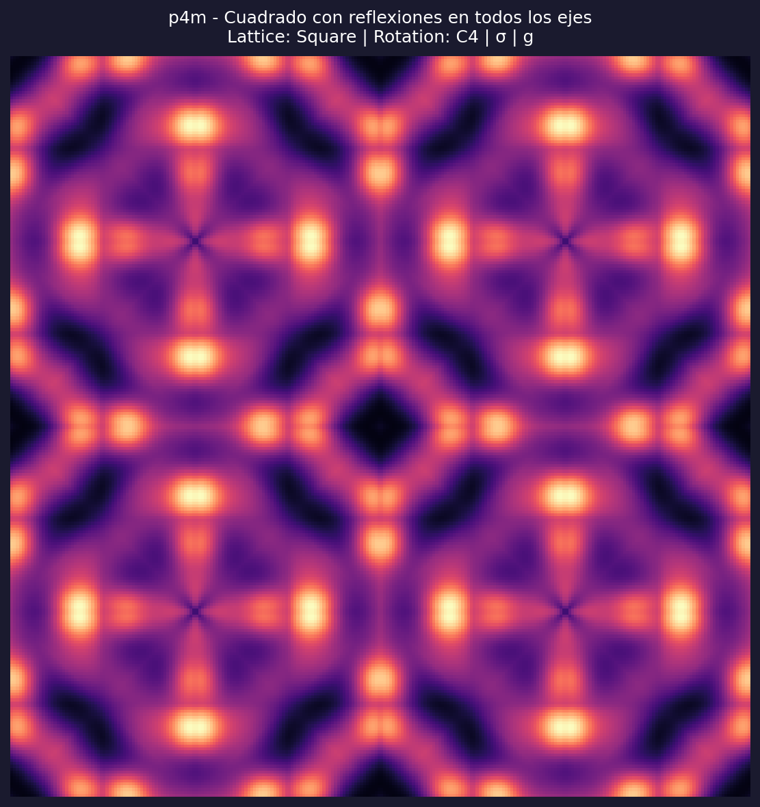
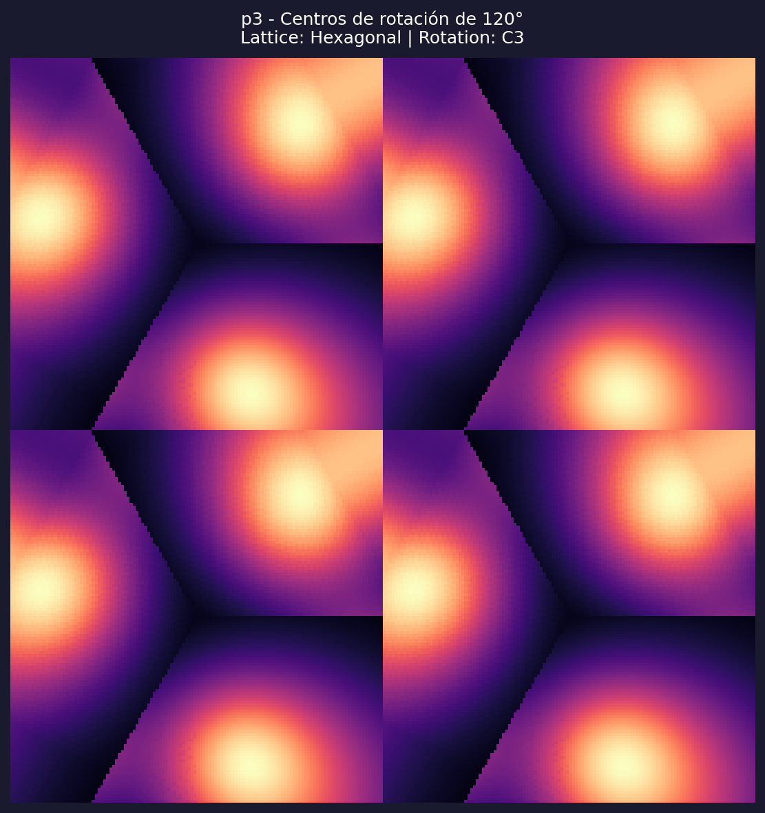
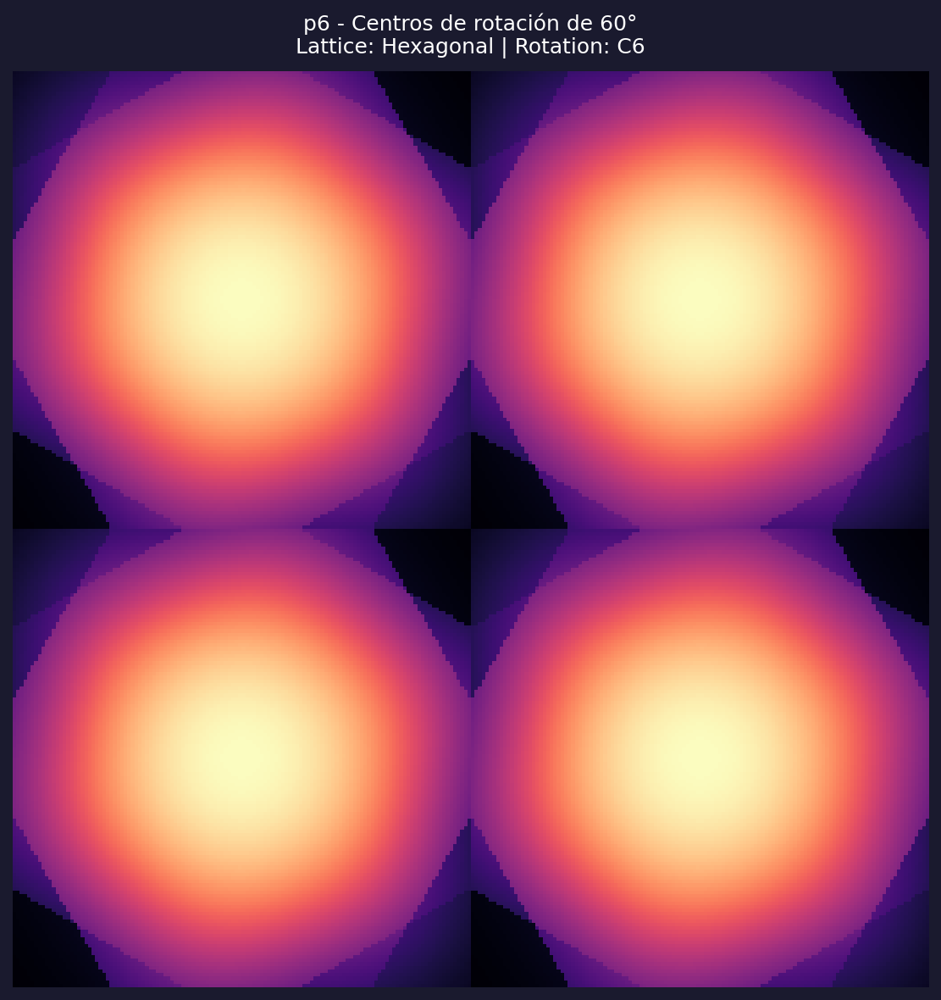
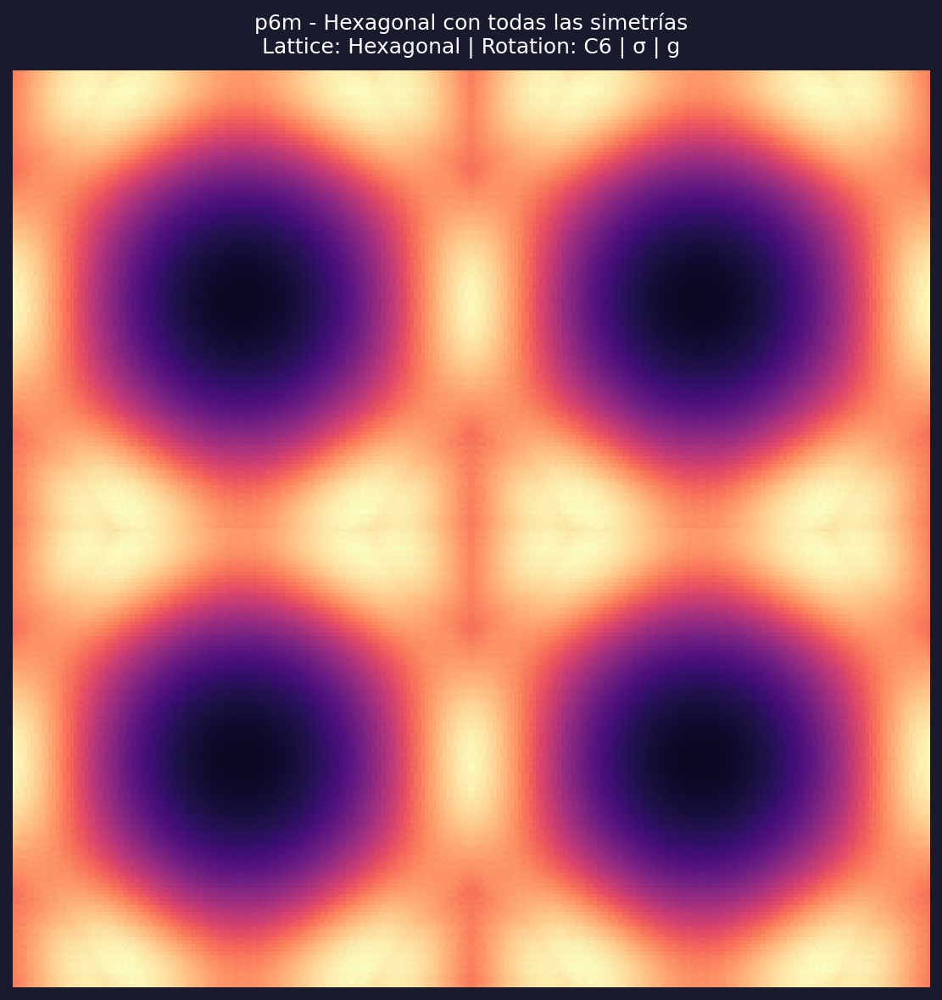
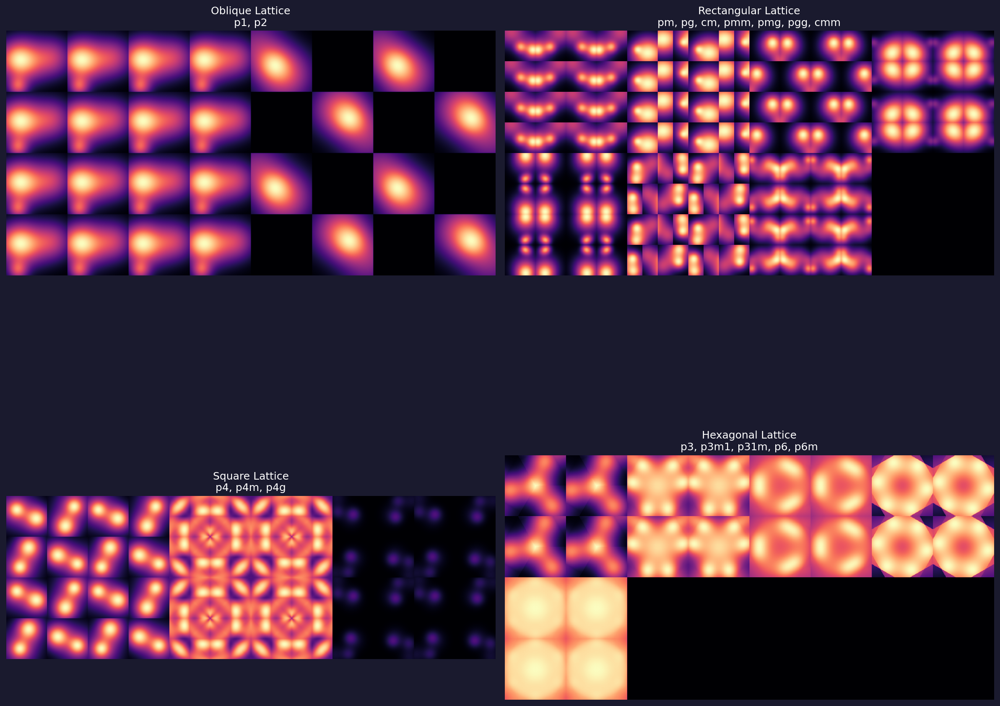

# Los 17 Grupos de Papel Tapiz

## Una Guía Matemática Completa

---

## 1. Conceptos Fundamentales

### 1.1 ¿Qué es un Patrón Periódico?

Un **patrón periódico bidimensional** es un diseño que se repite infinitamente en el plano en dos direcciones independientes. Pensá en:

- El papel tapiz de una pared
- Los azulejos de un piso
- Un panal de abejas
- Los patrones de los cristales

Formalmente, un patrón es periódico si existen dos vectores $\vec{a}$ y $\vec{b}$ (no paralelos) tales que trasladar el patrón por cualquier combinación $m\vec{a} + n\vec{b}$ (donde $m, n$ son enteros) produce el mismo patrón.

### 1.2 ¿Qué es una Simetría?

Una **simetría** es una transformación que deja el patrón invariante (igual a sí mismo). Las simetrías posibles en el plano son:

| Simetría | Símbolo | Descripción | Ejemplo Visual |
|----------|---------|-------------|----------------|
| **Traslación** | $T$ | Mover sin rotar ni reflejar | → → → |
| **Rotación** | $C_n$ | Girar $\frac{360°}{n}$ alrededor de un punto | ↻ |
| **Reflexión** | $\sigma$ | Espejo respecto a una línea | ⟷ |
| **Reflexión con deslizamiento** | $g$ | Espejo + traslación paralela al eje | ↮ |

### 1.3 ¿Qué es el Orden de Rotación?

El **orden de rotación** $n$ indica cuántas veces hay que rotar para volver al inicio:

$$C_n = \text{rotación de } \frac{360°}{n}$$

| Orden $n$ | Ángulo | Nombre | Ejemplo |
|-----------|--------|--------|---------|
| 1 | 360° | Trivial (sin rotación) | Letra "R" |
| 2 | 180° | Binaria | Letra "S" |
| 3 | 120° | Ternaria | Triángulo equilátero |
| 4 | 90° | Cuaternaria | Cuadrado |
| 6 | 60° | Senaria | Hexágono |

---

## 2. La Restricción Cristalográfica

### 2.1 El Teorema

> **Teorema (Restricción Cristalográfica):** En un patrón periódico bidimensional, los únicos órdenes de rotación posibles son $n \in \{1, 2, 3, 4, 6\}$.

**¿Por qué no puede haber rotación de orden 5, 7, 8, etc.?**

### 2.2 Demostración Intuitiva

Imaginá que tenés una red de puntos que se repiten periódicamente (como una grilla infinita). Si hay un centro de rotación $C_n$, entonces:

1. Tomá un punto $P$ de la red
2. Rotalo $\frac{360°}{n}$ para obtener $P'$
3. $P'$ también debe ser un punto de la red
4. La distancia entre puntos de la red tiene un mínimo (no puede ser arbitrariamente pequeña)

Esta restricción geométrica implica que:

$$2\cos\left(\frac{2\pi}{n}\right) \in \mathbb{Z}$$

Los únicos valores de $n$ que satisfacen esto son $\{1, 2, 3, 4, 6\}$.

| $n$ | $\cos(2\pi/n)$ | $2\cos(2\pi/n)$ | ¿Entero? |
|-----|----------------|-----------------|----------|
| 1 | 1 | 2 | ✓ |
| 2 | -1 | -2 | ✓ |
| 3 | -0.5 | -1 | ✓ |
| 4 | 0 | 0 | ✓ |
| 5 | 0.309... | 0.618... | ✗ |
| 6 | 0.5 | 1 | ✓ |
| 7 | 0.623... | 1.247... | ✗ |

Por eso **no existen** patrones periódicos con simetría de orden 5, 7, 8, etc.

---

## 3. Teoría de Grupos

### 3.1 ¿Qué es un Grupo?

Un **grupo** $(G, \cdot)$ es un conjunto $G$ con una operación $\cdot$ que cumple:

| Propiedad | Definición | Significado |
|-----------|------------|-------------|
| **Clausura** | Si $a, b \in G$, entonces $a \cdot b \in G$ | Combinar dos simetrías da otra simetría |
| **Asociatividad** | $(a \cdot b) \cdot c = a \cdot (b \cdot c)$ | El orden de agrupación no importa |
| **Identidad** | Existe $e$ tal que $e \cdot a = a \cdot e = a$ | Existe "no hacer nada" |
| **Inverso** | Para cada $a$, existe $a^{-1}$ tal que $a \cdot a^{-1} = e$ | Toda transformación se puede deshacer |

### 3.2 Grupos de Simetría Puntuales

Los grupos que describen simetrías alrededor de un punto fijo son:

| Grupo | Elementos | Orden |
|-------|-----------|-------|
| $C_1$ | $\{e\}$ | 1 |
| $C_2$ | $\{e, R_{180°}\}$ | 2 |
| $C_3$ | $\{e, R_{120°}, R_{240°}\}$ | 3 |
| $C_4$ | $\{e, R_{90°}, R_{180°}, R_{270°}\}$ | 4 |
| $C_6$ | $\{e, R_{60°}, R_{120°}, R_{180°}, R_{240°}, R_{300°}\}$ | 6 |
| $D_n$ | $C_n$ + reflexiones | $2n$ |

### 3.3 El Teorema de los 17 Grupos

> **Teorema:** Existen exactamente **17** grupos de simetría para patrones periódicos en el plano (los "grupos de papel tapiz" o "grupos cristalográficos planos").

---

## 4. Los 17 Grupos de Papel Tapiz

### 4.1 Clasificación por Tipo de Red

Los 17 grupos se organizan según la forma de la celda unitaria:

```
┌─────────────────────────────────────────────────────────────┐
│  OBLICUA (2)        │  RECTANGULAR (7)    │  CUADRADA (3)  │
│  ┌───┐              │  ┌───┐              │  ┌───┐         │
│  │  ╱│  p1, p2      │  │   │  pm, pg, cm  │  │   │  p4     │
│  │╱  │              │  │   │  pmm, pmg    │  │   │  p4m    │
│  └───┘              │  └───┘  pgg, cmm    │  └───┘  p4g    │
├─────────────────────┴─────────────────────┴────────────────┤
│  HEXAGONAL (5)                                              │
│     ╱╲                                                      │
│    ╱  ╲     p3, p3m1, p31m, p6, p6m                        │
│   ╱    ╲                                                    │
│  ╱──────╲                                                   │
└─────────────────────────────────────────────────────────────┘
```

### 4.2 Tabla Completa de Propiedades

| Grupo | Red | Rotación | Reflexión | Glide | Orden del Grupo Puntual |
|-------|-----|----------|-----------|-------|------------------------|
| p1 | Oblicua | $C_1$ | ✗ | ✗ | 1 |
| p2 | Oblicua | $C_2$ | ✗ | ✗ | 2 |
| pm | Rectangular | $C_1$ | $\sigma$ | ✗ | 2 |
| pg | Rectangular | $C_1$ | ✗ | $g$ | 2 |
| cm | Rectangular | $C_1$ | $\sigma$ | $g$ | 2 |
| pmm | Rectangular | $C_2$ | $\sigma_v, \sigma_h$ | ✗ | 4 |
| pmg | Rectangular | $C_2$ | $\sigma$ | $g$ | 4 |
| pgg | Rectangular | $C_2$ | ✗ | $g_v, g_h$ | 4 |
| cmm | Rectangular | $C_2$ | $\sigma_v, \sigma_h$ | $g$ | 4 |
| p4 | Cuadrada | $C_4$ | ✗ | ✗ | 4 |
| p4m | Cuadrada | $C_4$ | $\sigma$ (4 ejes) | $g$ | 8 |
| p4g | Cuadrada | $C_4$ | $\sigma$ (diagonal) | $g$ | 8 |
| p3 | Hexagonal | $C_3$ | ✗ | ✗ | 3 |
| p3m1 | Hexagonal | $C_3$ | $\sigma$ (3 ejes) | ✗ | 6 |
| p31m | Hexagonal | $C_3$ | $\sigma$ (3 ejes) | ✗ | 6 |
| p6 | Hexagonal | $C_6$ | ✗ | ✗ | 6 |
| p6m | Hexagonal | $C_6$ | $\sigma$ (6 ejes) | $g$ | 12 |

---

## 5. Operaciones de Simetría en Coordenadas

### 5.1 Matrices de Transformación

Cada simetría se puede representar como una matriz que actúa sobre las coordenadas $(x, y)$:

**Rotación por ángulo $\theta$:**

$$R_\theta = \begin{pmatrix} \cos\theta & -\sin\theta \\ \sin\theta & \cos\theta \end{pmatrix}$$

**Casos específicos:**

$$R_{90°} = \begin{pmatrix} 0 & -1 \\ 1 & 0 \end{pmatrix}, \quad R_{180°} = \begin{pmatrix} -1 & 0 \\ 0 & -1 \end{pmatrix}, \quad R_{120°} = \begin{pmatrix} -\frac{1}{2} & -\frac{\sqrt{3}}{2} \\ \frac{\sqrt{3}}{2} & -\frac{1}{2} \end{pmatrix}$$

**Reflexiones:**

$$\sigma_v = \begin{pmatrix} -1 & 0 \\ 0 & 1 \end{pmatrix} \text{ (vertical)}, \quad \sigma_h = \begin{pmatrix} 1 & 0 \\ 0 & -1 \end{pmatrix} \text{ (horizontal)}$$

### 5.2 Composición de Simetrías

Las simetrías se combinan multiplicando sus matrices:

$$\sigma_v \circ \sigma_h = \begin{pmatrix} -1 & 0 \\ 0 & 1 \end{pmatrix} \begin{pmatrix} 1 & 0 \\ 0 & -1 \end{pmatrix} = \begin{pmatrix} -1 & 0 \\ 0 & -1 \end{pmatrix} = R_{180°}$$

Esto demuestra que **dos reflexiones perpendiculares = una rotación de 180°**.

---

## 6. Análisis de Cada Grupo

### 6.1 Grupo p1 — Solo Traslaciones



**Simetrías:** Solo traslaciones $T_{\vec{a}}$ y $T_{\vec{b}}$

**Grupo puntual:** $C_1 = \{e\}$ (trivial)

**Dominio fundamental:** Toda la celda unitaria

**Implementación:**
```python
# Simplemente teselar el motivo
cell = motif
pattern = np.tile(cell, (tiles, tiles))
```

---

### 6.2 Grupo p2 — Rotación 180°



**Simetrías:** $C_2$ (rotación 180°) + traslaciones

**Grupo puntual:** $C_2 = \{e, R_{180°}\}$

**Propiedad matemática:** Para todo punto $(x, y)$ en el patrón:

$$f(x, y) = f(-x, -y)$$

**Implementación:**
```python
# El dominio fundamental es la mitad de la celda
cell[:half, :half] = fund
cell[half:, half:] = np.rot90(fund, 2)  # Rotación 180°
```

---

### 6.3 Grupo pm — Reflexión Vertical



**Simetrías:** Reflexión $\sigma_v$ + traslaciones

**Propiedad matemática:**

$$f(x, y) = f(-x, y)$$

**Implementación:**
```python
cell = np.hstack([motif, np.fliplr(motif)])
```

---

### 6.4 Grupo pmm — Reflexiones Perpendiculares



**Simetrías:** $\sigma_v + \sigma_h + C_2$ (emergente)

**Grupo puntual:** $D_2 = \{e, \sigma_v, \sigma_h, C_2\}$ (grupo de Klein)

**Relación importante:**

$$\sigma_v \circ \sigma_h = C_2$$

**Implementación:**
```python
top = np.hstack([motif, np.fliplr(motif)])      # [M | σ_v(M)]
bottom = np.hstack([np.flipud(motif), np.rot90(motif, 2)])  # [σ_h(M) | C_2(M)]
cell = np.vstack([top, bottom])
```

---

### 6.5 Grupo p4 — Rotación 90°



**Simetrías:** $C_4$ + traslaciones (SIN reflexión)

**Grupo puntual:** $C_4 = \{e, R_{90°}, R_{180°}, R_{270°}\}$

**Propiedad matemática:**

$$f(x, y) = f(-y, x) = f(-x, -y) = f(y, -x)$$

**Implementación:**
```python
# Colocar 4 copias rotadas del dominio fundamental
cell[:n, :n] = fund
cell[:n, n:] = np.rot90(fund, 3)    # 270°
cell[n:, n:] = np.rot90(fund, 2)    # 180°
cell[n:, :n] = np.rot90(fund, 1)    # 90°
```

---

### 6.6 Grupo p4m — Cuadrado con Todas las Reflexiones



**Simetrías:** $C_4 + \sigma_v + \sigma_h + \sigma_{d1} + \sigma_{d2}$

**Grupo puntual:** $D_4$ (orden 8)

**El dominio fundamental es 1/8 de la celda** (un triángulo)

---

### 6.7 Grupo p3 — Rotación 120°



**Simetrías:** $C_3$ + traslaciones

**Ángulo de rotación:**

$$\theta = \frac{2\pi}{3} = 120°$$

**Matriz de rotación:**

$$R_{120°} = \begin{pmatrix} -\frac{1}{2} & -\frac{\sqrt{3}}{2} \\ \frac{\sqrt{3}}{2} & -\frac{1}{2} \end{pmatrix}$$

---

### 6.8 Grupo p6 — Rotación 60°



**Simetrías:** $C_6$ + traslaciones

**Grupo puntual:** $C_6 = \{e, R_{60°}, R_{120°}, R_{180°}, R_{240°}, R_{300°}\}$

**Nota:** $C_6$ contiene a $C_3$ y a $C_2$ como subgrupos.

---

### 6.9 Grupo p6m — Máxima Simetría Hexagonal



**Simetrías:** $C_6$ + 6 ejes de reflexión

**Grupo puntual:** $D_6$ (orden 12)

**El dominio fundamental es 1/12 de la celda**

Este es el grupo con **más simetrías** de los 17.

---

## 7. Visión General

### Todos los 17 Grupos


### Comparación por Tipo de Red



---

## 8. Verificación Matemática

Para verificar que un patrón tiene la simetría correcta, comparamos:

$$\text{correlación} = \frac{\langle P, T(P) \rangle}{\|P\| \cdot \|T(P)\|}$$

donde $T$ es la transformación de simetría y $P$ es el patrón.

| Correlación | Interpretación |
|-------------|----------------|
| $\approx 1.0$ | Simetría **presente** |
| $\approx 0$ | Simetría **ausente** |
| $< 0$ | Anti-correlación (simetría ausente) |

### Resultados de Verificación

| Grupo | $C_2$ (180°) | $C_4$ (90°) | $C_3$ (120°) | $\sigma_v$ |
|-------|-------------|-------------|--------------|------------|
| p1 | 0.48 | -0.32 | -0.08 | 0.33 |
| p2 | **1.00** | -0.74 | -0.44 | -0.74 |
| p4 | **1.00** | **1.00** | -0.21 | -0.29 |
| p4m | **1.00** | **1.00** | 0.38 | **1.00** |
| p6 | **1.00** | 0.98 | **0.86** | 0.98 |
| p6m | **1.00** | **1.00** | **1.00** | **1.00** |

---

## 9. Referencias

1. **Schattschneider, D.** (1978). "The Plane Symmetry Groups: Their Recognition and Notation". *The American Mathematical Monthly*, 85(6), 439-450.

2. **Conway, J.H., et al.** (2008). *The Symmetries of Things*. A K Peters/CRC Press.

3. **International Tables for Crystallography, Vol. A** (2016). Space-group symmetry. Springer.

---

## Apéndice: Generadores de Cada Grupo

| Grupo | Generadores | Relaciones |
|-------|-------------|------------|
| p1 | $t_1, t_2$ | — |
| p2 | $t_1, t_2, C_2$ | $C_2^2 = e$ |
| pm | $t_1, t_2, \sigma$ | $\sigma^2 = e$ |
| pmm | $t_1, t_2, \sigma_v, \sigma_h$ | $\sigma_v \sigma_h = C_2$ |
| p4 | $t_1, t_2, C_4$ | $C_4^4 = e$ |
| p4m | $t_1, t_2, C_4, \sigma$ | $C_4^4 = \sigma^2 = e$ |
| p3 | $t_1, t_2, C_3$ | $C_3^3 = e$ |
| p6 | $t_1, t_2, C_6$ | $C_6^6 = e$ |
| p6m | $t_1, t_2, C_6, \sigma$ | $C_6^6 = \sigma^2 = e$ |

---

*Documento generado para el proyecto de cristalografía computacional.*
